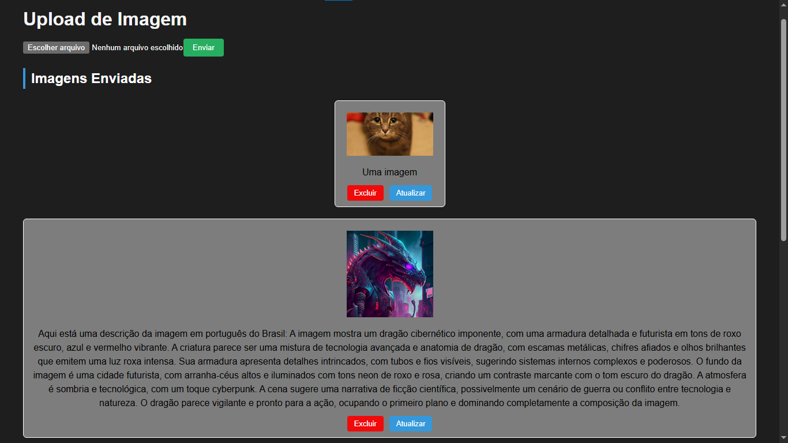

# MongoDB + Vue + Gemini

Projeto de upload de imagens para o mongoDB.

O projeto original, o back-end, é feito com a imerssão da Alura com inteligência artificial, usando o gemini do google.

Agora essa versão, mais atualizada, conta com parte do front-end usando o `Vue.js`, para o consumo dessa api para melhorar a forma de interação para realizar o upload de imagens e ter a descrição automática.

No projeto local, as imagens enviadas para o banco, ficam armazenadas no diretóro ''uploads'', onde elas ficam com o nome original quando é enviada e, quando realiza a atualização para obter a descrição pela IA do google, o nome do arquivo é trocado pelo id que a imagem ficou armazenada no mongo.

## Comandos a serem utilizados

Iniciar o servidor back-end local: `npm run dev`
Entrar no diretório do frontend: `cd frontend`
Iniciar o servidor do front-end local: `npm run dev` 

A Imagem abaixo mostra o resultado final desse projeto

